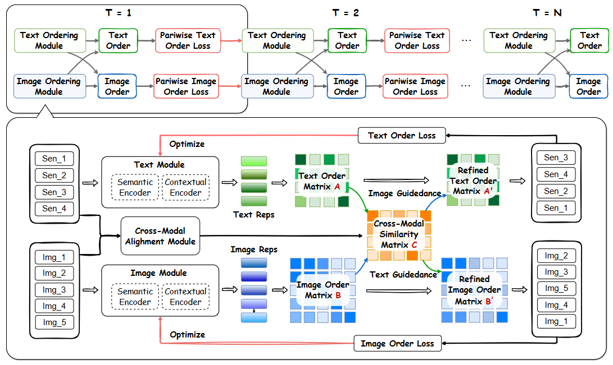

# IterWeGO
Implementation of our paper, "Leveraging Weak Cross-Modal Guidance for Coherence Modelling via Iterative Learning".

## Introduction
Cross-modal coherence modeling is essential for intelligent systems to help them organize and structure information, thereby understand and create content of the physical world coherently like human-beings. Previous work on cross-modal coherence modeling attempted to leverage the order information from another modality to assist the coherence recovering of the target modality. Despite of the effectiveness, labeled associated coherency information is not always available and might be costly to acquire, making the cross-modal guidance hard to leverage. To tackle this challenge,this paper explores a new way to take advantage of cross-modal guidance without gold labels on coherency, and proposes the **Weak Cross-Modal Guided Ordering (WeGO)** model. More specifically, it leverages high-confidence predicted pairwise order in one modality as reference information to guide the coherence modeling in another. An iterative learning paradigm is further designed to jointly optimize the coherence modeling in two modalities with selected guidance from each other. The iterative cross-modal boosting also functions in inference to further enhance coherence prediction in each modality. Experimental results on two public datasets have demonstrated that the proposed method outperforms existing methods for cross-modal coherence modeling tasks. Major technical modules have been evaluated effective through ablation studies



## Requirements 
We recommended the following dependencies.

* Python 3.8.0
* [PyTorch](http://pytorch.org/) (1.8.0)
* [NumPy](http://www.numpy.org/) (1.24.3)
* [transformers](https://huggingface.co/docs/transformers) (4.29.2)
* [torchvision]()


## Download data and pretrained model
### Dataset
The SIND dataset can be downloaded from the Visual Storytelling website https://visionandlanguage.net/VIST/dataset.html

For TACoS-Ordering dataset, the raw TACoS Multi-Level Corpus can be downloaded from https://www.mpi-inf.mpg.de/departments/computer-vision-and-machine-learning/research/vision-and-language/tacos-multi-level-corpus/. The image frames for sampling and corresponding sentences can be downloaded from [here](https://drive.google.com/drive/folders/1qtdGO-CXlnaV30WrTdGo9fcR-rJKGeYN?usp=drive_link)

### Preprocessing
Run the resize.py to resize all the images:

```
python resize.py --image_dir [image_dir] --output_dir [output_dir]
```

Run the prepare_data_img.py to prepare test img data:

```
python prepare_data_img.py --data_dir [sind_data_dir] --out_dir [output_dir] --task_name sind
```

### Pretrained model
Please download the pretrained model from [here](https://drive.google.com/drive/folders/1q-zCIm2_XsFkhVfXJCyK879jCrds59Uw?usp=drive_link)

## Training
```
python main.py --train_image_dir [train_img_dir] --val_image_dir [val_img_dir] --train_sis_path sind/sis/train.story-in-sequence.json --val_sis_path sind/sis/val.story-in-sequence.json
```

## Evaluate trained models
```
python eval.py --img_test_data_path data/img/test.tsv --txt_test_data_path data/sent/test.tsv
```

## Citation
If our work is helpful to your research, please cite:

```
@inproceedings{MM24IterWEGO,
  author    = {Yi Bin and
               Junrong Liao and
               Yujuan Ding and
               Haoxuan Li and
               Yang Yang and
               See-Kiong Ng and
               Heng Tao Shen,
  title     = {Leveraging Weak Cross-Modal Guidance for Coherence Modelling via Iterative Learning},
  booktitle = {Proceedings of the 32th ACM International Conference on Multimedia, 28 October – 1 November, 2024, Melbourne, Australia.},
  year      = {2024},
}
```
